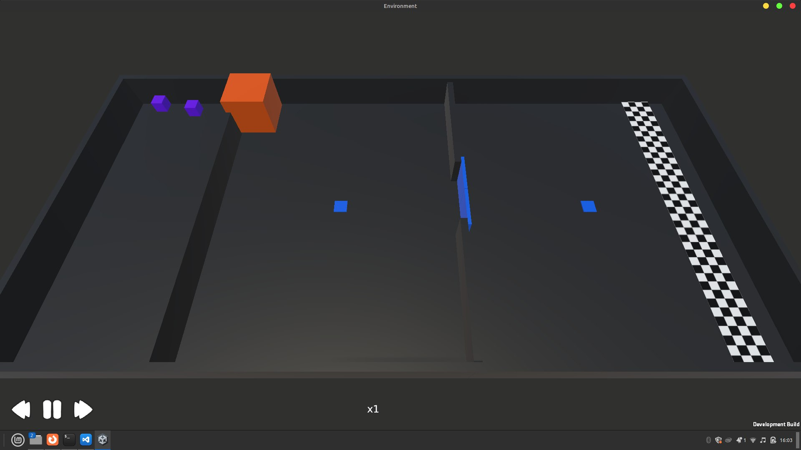
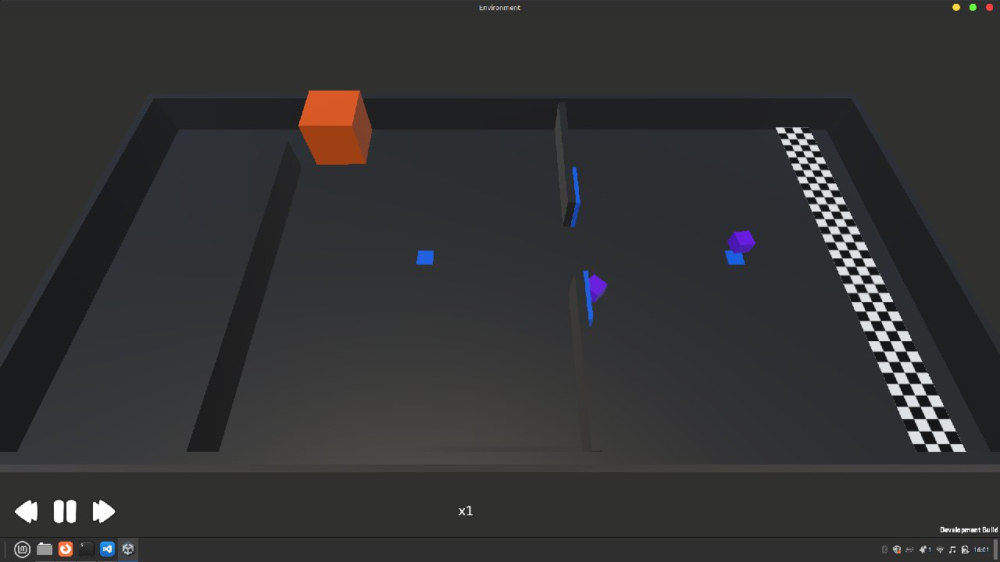

# Hierarchical Multi-agent Reinforcement Learning

This Unity project features a hierarchical cooperative multi-agent environment where agents must work together to solve a two-part puzzle. The goal is to demonstrate how agents can solve complex tasks by breaking them into sub-tasks.

## Overview



The environment consists of two main tasks:
1. **Collaborative Box Pushing**  
   Both agents must collaborate to push a heavy box (which can only be pushed by the force of two agents) out of the area so they can move to the next room.
   
2. **Pressure Plate and Door Mechanism**  
   - The second room contains a door and two pressure plates, the door only opens as long as the pressure plate is pressed and it closes when it's not pressed.
   - One agent must stay on the pressure plate from the inner side to open the door temporarily for the other agent.  
   - While the door is open, the other agent crosses to the other side.  
   - The second agent steps and stays on the other pressure plate outside the door, allowing the first agent to cross.

3. **Completion**
The episode is ended when both agents successfully navigate the puzzle and reach the goal area or when agents have taken 100000 steps.

## Features

- **Collaborative Physics Interaction**: Agents need to combine their forces to push the box. 
- **Dynamic Environment**: The door opens only when a pressure plate is pressed.
- **Sequential Problem-Solving**: Agents must alternate roles to complete the puzzle.



## Observation Space

Agents posses 6 Raycast Sensors to observe the following tags: Other Agents, Walls, Box, Pressure plates, Door, Checkpoint. As well as vector observations that contain the state of pressure plate (pressed or not) and wether or not the agent has found the checkpoint.

## Action Space

1 discrete action branch with 7 actions, corresponding to:

- Do nothing.

- Move forward.

- Move backward.

- Move Left.

- Move right.

- Rotate clockwise.

- Rotate counterclockwise.

## Reward function

- Agents recieve an existence punishment of `-0.25/max_environment_steps` each step of the ongoing episode.
- If an agent is still in the same room while the other agent is stepping on the plate they recieve a penalty of `-2/max_environment_steps` each step of the ongoing episode.
- If an agent left through the door while the other agent is still in the first room they recieve a penalty of `-4/max_environment_steps` each step of the ongoing episode.
- If both agents leave they recieve a reward of `0.5/max_environment_steps` each step of the ongoing episode. 
- If both agents find the checkpoint they recieve a reward of 2 and the episode is ended.


## Requirements

1. Python (>= 3.10.1, <=3.10.12). 
2. Unity 6 if you want to manipulate and edit the environment.

## Installation

1. Clone this repository.

2. Create a new python virtual environment:

```
conda create -n mlagents python=3.10.12 && conda activate mlagents
```

3. Install the unity ML-Agents python package:

```
pip install mlagents==1.1.0
```
```
pip install mlagents_envs==1.1.0
```

## Training

- You can start training with the following command (you can add `--torch-device=cuda` if you have a cuda gpu):

```
mlagents-learn config/<config>.yaml --env=build/puzzle --run-id=<run_id>
```

- You can also cancel the training at any time and resume it with:
```
 mlagents-learn config/<config>.yaml --env=build/puzzle --run-id=<run_id> --resume
```

## Inference

- To see how well your agents trained you can run this command: 

```
mlagents-learn config/<config>.yaml --env=build/puzzle --run-id=<run_id> --resume --inference
```

- Alternatively you can see our already pretrained model by running `puzzle.x86_64` if you are on Linux or `Envrionment.exe` if you are on Windows (lacated at `demo_build` folder).